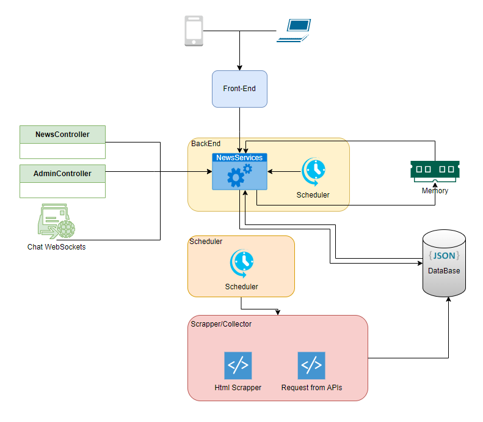
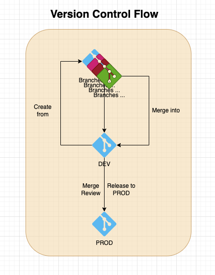

# gavelnews
2021
2024 (updated)

# Setup
0. if not existing create Data/ folder inside ./services/ dir, chats/ folder inside ./services/Data/ dir and users/allUsers.json file with ([] empty array) inside ./service/Data/
1. npm install
3. gulp build
4. gulp compile
5. go to /services/WebScraperService:
    - create virtual env:
        - python -m venv .packages
    - start it:
        - source .packages/bin/activate
    - install dependencies:
        - pip install -r requirements.txt
7. create system.config.js file from template and apply suitable configuration depending on your OS        
8. pm2 start system.config.js

> [!IMPORTANT]  
> Data/ folder must exist inside ./services/ path (in some cases it may be necessary the manual creation of it once)

> [!WARNING]  
> chmod +x run.sh (this may be necessary)

> [!IMPORTANT]  
> Schedulers
> Scraper and News day change must run between 00:00 - 00:30

## Project Structure:
### Architecture


### Version Control Flow


## TODO:
- [x] ``` waitForAllData() ``` change interval time from 100 to 1 or a bit higher, this is supposed to not run longer;
- [x] implement lazyload on scroll event;
- [x] create endpoints for filtering and sorting;
- [x] search function should request from server instead of looking on the client existing data;
- [x] backoffice page and service to check platform utilization;
- [x] implement chat backend validations (username limit chars, block script/html injection and reserved username keywors);
- [x] implement google auth for people that want to vote;
- [x] implement (ip + useragent) identifier for guests;
- [x] guests are allowed to text in the chat and are indentified as guests;
- [x] send only necessary information as response, rename new_votedIps to new_votedEmails and remove it when sending the news data.
- [x] display only allowed dates in the date picker
- [x] align on background color
- [x] adapt previous dates page design
- [x] logo
- [x] button colors
- [x] menu and footer colors
- [x] filter by category
- [ ] search input box smaller ?
- [ ] about page ? 
- [ ] contact page ?
- [ ] welcome page for first users ?
- [ ] google auth refresh token 
- [ ] let votes open until lock
- [ ] write log system
- [ ] description only appears on detailed page, also allow comments
- [ ] link and chat buttons on same row
- [ ] overlay explaining concept that appears only once
- [ ] only 3 buttons (true, false, unclear)
- [ ] separator for trending news (not prio)
- [ ] change icons to (check, cross and question mark)
- [ ] backoffice - news with most activity
- [ ] date formatted to text
- [ ] width/height fixed in categories and news source buttons 
- [ ] add aditional keys on data ETL level